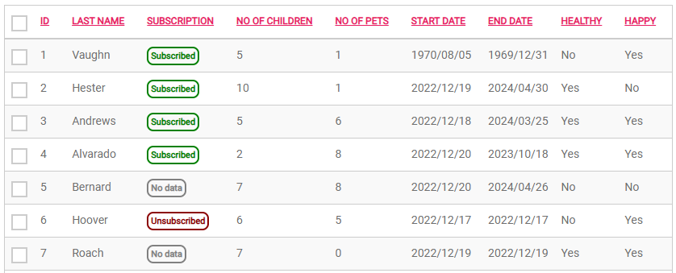

# How-to: DataGrid Pills

This example demonstrates how to style column content in a DataGrid as pills. The pills can be used to represent a status or similar enum value of each row in the grid. However, the CSS can be altered to faciliate any other display. 

Example:


## Steps
1. Create a new DataGrid and populate it with DataGrid
2. Open the DataGrid's `Columns` property and select the column you want to display as pills
    1. In the `Cell Display` property, select `Ellipsis`
    2. Add a class of your coice to the `Classes` property (e.g. pill)


3. Add CSS similar to the below to your stylesheet. 

This example assigns a base style for all cells containing the CSS class `pills` and additionally styles DataGrid content for the values `Subscribed`, `Unsubscribed`, and `No data` in separate colours. You can modify the CSS to suit your needs.
```css
.pill span {
	font-weight: bold;
	font-size: 1.1rem;
	border-radius: 0.8rem;
	padding: 0.3rem;
	border-width: 0.2rem;
	border-style: solid;
}
.pill span[title='Subscribed'] {
	color: green;
	border-color: green;
}
.pill span[title='Unsubscribed'] {
	color: darkred;
	border-color: darkred;
}
.pill span[title='No data'] {
	color: grey;
	border-color: grey;
}
```